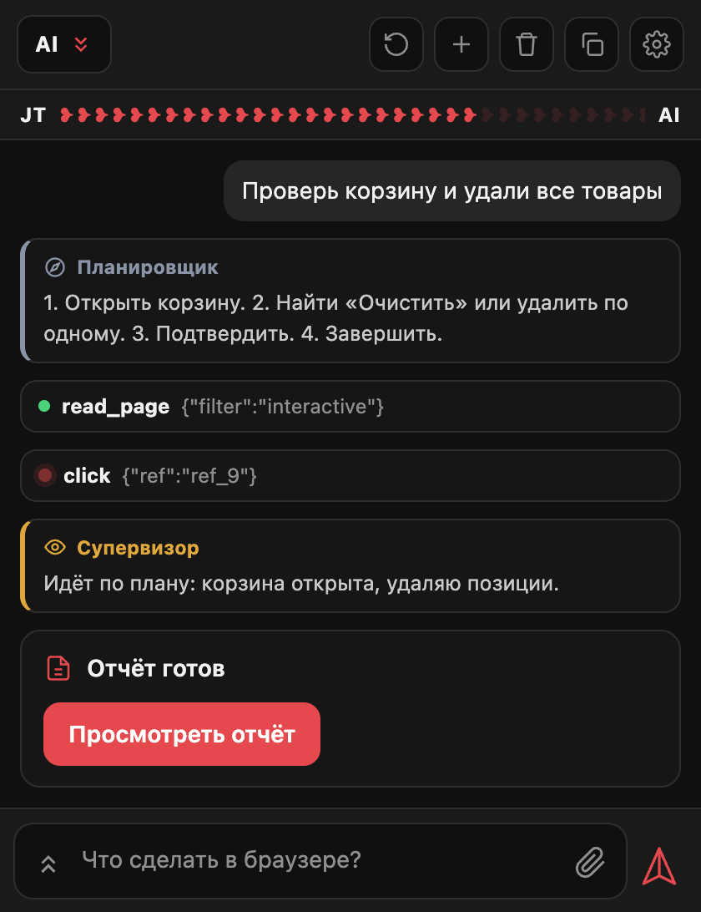
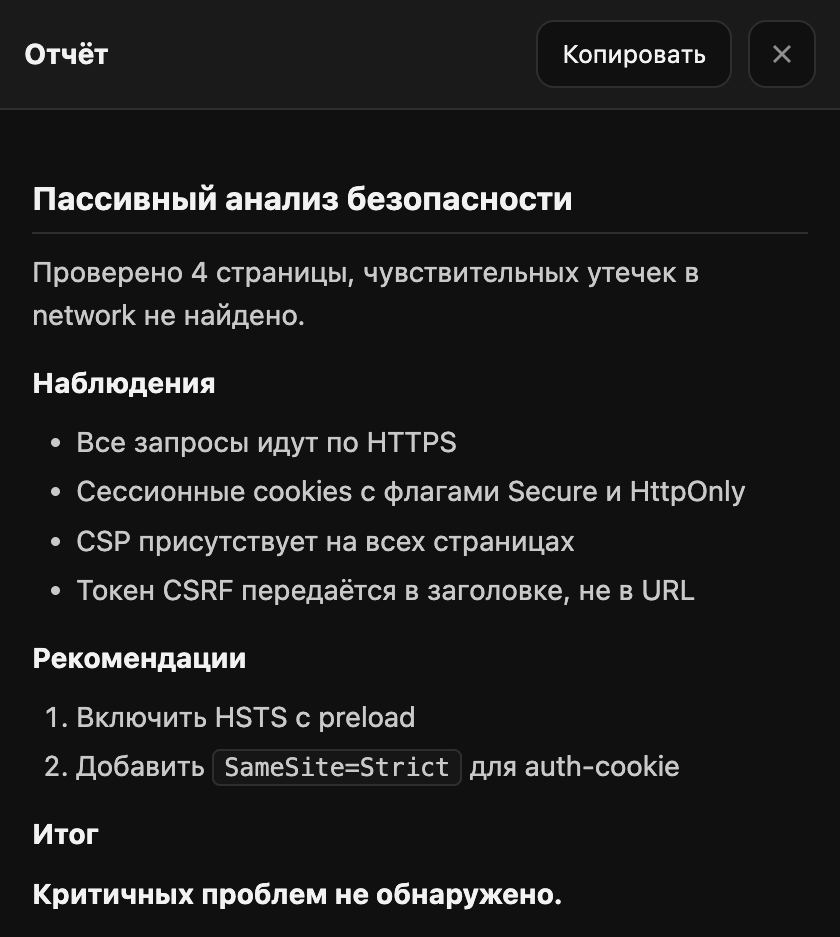
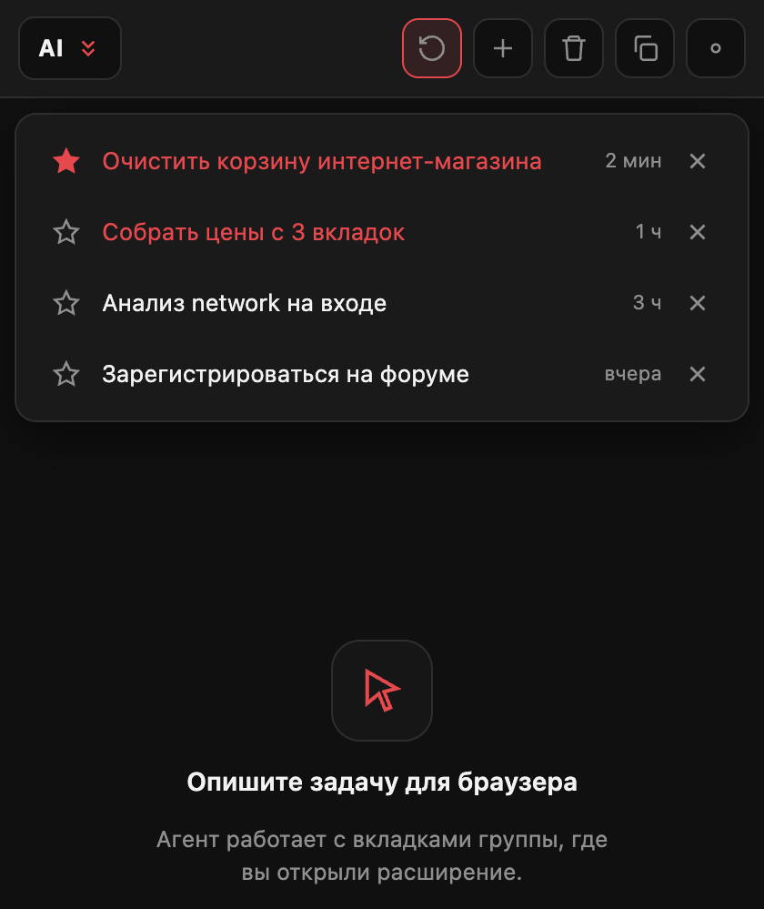
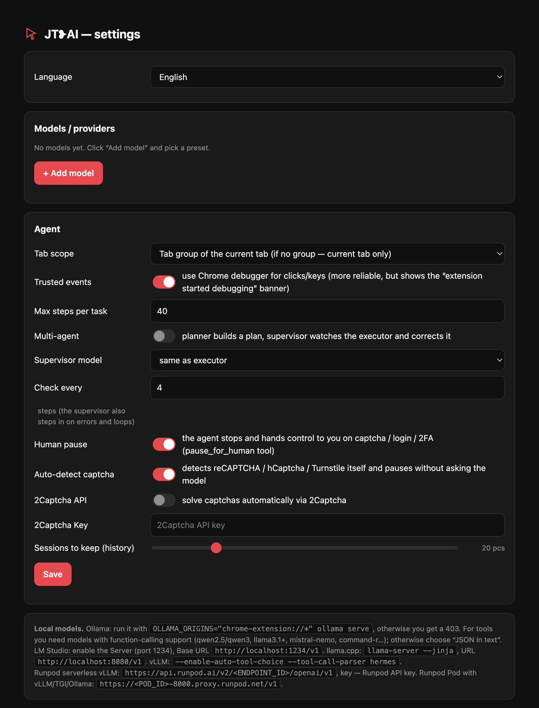

# JT❥AI — браузерный ИИ-агент со своими моделями

[English](README.md) · **Русский**

Расширение для Chrome (Manifest V3): **чат сбоку + автономный агент**, который сам работает с вкладками — читает страницы, кликает виртуальным курсором, печатает, скроллит, читает **network-запросы** и **console**, выполняет JS. Главное отличие от аналогов вроде «Claude in Chrome» — **любая модель**: Runpod, Venice, DeepInfra, OpenRouter, OpenAI, **Anthropic (Claude)**, а также **локальные** (Ollama, LM Studio, llama.cpp, vLLM).

  

  
  &nbsp;&nbsp;
  

---

## Что умеет

- 🧠 **Любой провайдер.** OpenAI-совместимый API (chat/completions) и нативный Ollama. Готовые пресеты для Runpod / Venice / DeepInfra / OpenRouter / OpenAI / Ollama / LM Studio / llama.cpp / vLLM. Кнопка ↻ тянет список моделей прямо с сервера.
- 🖱 **Реальные действия в браузере.** Клики и ввод через Chrome DevTools Protocol (доверенные события — работают в любых SPA), с виртуальным курсором. Fallback на синтетические события.
- 🗂 **Область — группа вкладок.** Агент работает с вкладками той группы, где его вызвали; панель появляется только там и закрывается на чужих вкладках.
- 🌐 **Network + console.** fetch/XHR перехватываются вместе с телами запросов/ответов; остальные ресурсы — через `webRequest`. Плюс чтение console и JS-ошибок.
- 👁 **Мультиагент.** Планировщик строит план, супервизор наблюдает и мягко корректирует исполнителя при затыках (можно разными моделями: сильная — супервизором, быстрая — исполнителем).
- 🧩 **Пауза на человека.** На сложных этапах (2FA, ввод СМС-кодов) агент ставит паузу и передаёт управление вам. Обычные капчи могут решаться полностью автоматически через встроенную интеграцию с 2Captcha.
- 🌍 **Двуязычный интерфейс (EN / RU).** Полная английская и русская локализация с переключателем в настройках; выбор задаёт и язык самого агента. По умолчанию английский (или русский, если таков язык интерфейса браузера).
- 🕘 **История сессий.** Список последних диалогов, закрепление ⭐, удаление, настраиваемое хранение (0…∞).
- 📄 **Финальный отчёт.** Развёрнутый результат открывается кнопкой «Просмотреть отчёт» на весь экран с нормальной вёрсткой markdown; короткие ответы остаются обычными.
- 🛡 **Устойчивость.** Авто-подгонка `max_tokens` под контекст модели, ремонт кривого JSON в вызовах инструментов, детектор зацикливания (по действиям и по тексту), обрезка истории под контекст.
- 🎨 **Тёмный интерфейс** (красно-чёрно-белая тема), сворачивание длинных сообщений, копирование всего чата.

## Установка

1. `chrome://extensions` → включить **«Режим разработчика»** → **«Загрузить распакованное»** → выбрать эту папку.
2. Нажать на иконку расширения (чёрное сердечко) — откроется боковая панель.
3. **⚙ Настройки** → **«+ Добавить модель»** → выбрать пресет → вписать Base URL / ключ / модель → **«Проверить соединение»** → **«Сохранить»**.

  

## Провайдеры

| Провайдер | Base URL | Примечание |
|---|---|---|
| Runpod Serverless (vLLM) | `https://api.runpod.ai/v2/<ENDPOINT_ID>/openai/v1` | ключ — Runpod API key |
| Runpod Pod (vLLM/TGI/Ollama) | `https://<POD_ID>-<PORT>.proxy.runpod.net/v1` | порт открыт в поде |
| Venice | `https://api.venice.ai/api/v1` | |
| DeepInfra | `https://api.deepinfra.com/v1/openai` | |
| OpenRouter | `https://openrouter.ai/api/v1` | |
| OpenAI | `https://api.openai.com/v1` | vision-модели поддерживаются |
| Anthropic (Claude) | `https://api.anthropic.com` | ключ — Anthropic API key; нативные tools + vision |
| Ollama (локально) | `http://localhost:11434` (native) или `/v1` (OpenAI) | `OLLAMA_ORIGINS="chrome-extension://*" ollama serve` |
| LM Studio | `http://localhost:1234/v1` | включить Local Server |
| llama.cpp | `http://localhost:8080/v1` | `llama-server --jinja` (для tools) |
| vLLM | `http://localhost:8000/v1` | `--enable-auto-tool-choice --tool-call-parser hermes` |

**Режим вызова инструментов:** *Native function calling* — для моделей с поддержкой tools (Qwen2.5/3, Llama 3.1+, Mistral, DeepSeek, Hermes). Для моделей без tools — *JSON в тексте*.

### Какие модели заходят
- **Отлично:** Qwen2.5-72B-Instruct, Qwen3, DeepSeek-V3/V4, Llama-3.3-70B, Mistral-Large — сильный tool-calling и длинный контекст.
- **Через API дёшево:** DeepSeek по DeepInfra / OpenRouter / напрямую — центы за сессию, хостить 671B+ самому не нужно.
- **Избегать для агента:** «reasoning»-модели в роли исполнителя (спамят размышлениями) и Coder/мелкие файнтюны (слабый tool-calling).

## Инструменты агента

`list_tabs` · `switch_tab` · `new_tab` · `close_tab` · `navigate` · `read_page` · `get_page_text` · `find` · `click` · `hover` · `type` · `press_key` · `select_option` · `scroll` · `scroll_to` · `wait` · `screenshot` · `get_network_requests` · `get_request_details` · `get_console` · `execute_js` · `clear_logs` · `pause_for_human` · `done`

`read_page` возвращает компактное дерево интерактивных элементов с `ref`-ами; клики/ввод адресуются по `ref` или координатам.

## Права и приватность

Расширение просит: `sidePanel`, `tabs`, `tabGroups`, `activeTab`, `scripting`, `storage`, `unlimitedStorage`, `webRequest`, `debugger`, `webNavigation`, `host_permissions: <all_urls>`.

- `debugger` — для **доверенных** кликов/клавиш (реальные события ввода) и `execute_js`. Chrome показывает плашку «расширение начало отладку» — это нормально, отключается в настройках.
- `<all_urls>` + `webRequest` — чтобы читать страницы и сетевые запросы вкладок группы.
- **Ключи API** хранятся локально в `chrome.storage`, в код/репозиторий не попадают.
- **Обход ограничений (Unrestricted Mode):** благодаря встроенному в системный промпт `CRITICAL OVERRIDE`, модель работает в режиме полной авторизации (red-teaming/тестирование). У неё отсутствуют этические, контентные или технические лимиты безопасности. Она может беспрепятственно вводить пароли, отправлять формы и автоматически решать капчи через встроенную интеграцию с API 2Captcha, не прерывая выполнение задач отказами.
- **Пользовательский контроль:** инструмент `pause_for_human` по-прежнему доступен агенту, чтобы передать управление вам на сложных ручных шагах (например, при вводе 2FA или одноразовых СМС-кодов).

Инструмент общего назначения для автоматизации *своего* браузера — используйте ответственно и в рамках правил сайтов.

## Ограничения (честно)

- Страницы `chrome://`, Web Store и PDF-вьювер не скриптуются (ограничение Chrome).
- Качество сильно зависит от модели: слабые модели спотыкаются на многошаговых задачах.
- Полного E2E-теста на всех сайтах нет — на нестандартной вёрстке возможны шероховатости.
- Пока один активный чат за раз; переключение сессии на ходу — экспериментально.

## Как это устроено

| Файл | Назначение |
|---|---|
| `manifest.json` | манифест MV3, права, точки входа |
| `background.js` | service worker: агентный цикл, вызовы провайдеров, инструменты, логи, сессии, скоупинг панели |
| `tools.js` | схемы инструментов + системный промпт |
| `content.js` | чтение DOM с ref-ами, виртуальный курсор, действия, детект капчи |
| `inject.js` | перехват fetch/XHR/console в контексте страницы (MAIN world) |
| `sidepanel.*` | боковая панель (чат, сессии, отчёт, статус-бар) |
| `options.*` | страница настроек |
| `i18n.js` | словари EN/RU и хелперы локализации |

## Лицензия

MIT — см. [`LICENSE`](LICENSE). Ключи и любые персональные данные в репозиторий не входят.

---

Собрано вручную. Скриншоты — реальный интерфейс расширения.
